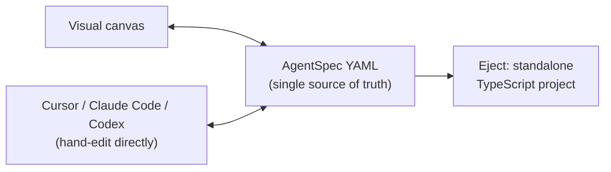

# Kampong Agents

A dev-first agent-workflow builder where the visual canvas and the underlying YAML spec are
the same thing, not two things kept in sync by convention. Design an agent on the canvas, or
hand-write the YAML in Cursor or Claude Code: either way you get one file, always safe to
commit, diff, and review. When you're ready, eject to a standalone TypeScript project with
zero further dependency on this tool.

## Status

Early. V1-V4 (canvas/YAML duality, local execution engine with guardrails/HITL, the local-first
CLI with mock/record tools and an Ollama adapter, and TypeScript export) are built and merged —
see [`SLICES.md`](./SLICES.md) for what's shipped versus roadmap.



## Design docs

- [`PLAN.md`](./PLAN.md): the problem, the scope, the requirements, the shape of the system.
- [`SLICES.md`](./SLICES.md): the build sequence, one demoable slice at a time.
- [`docs/adr/`](./docs/adr/): the architecture decisions and why each one was made.
- [`ideation.md`](./ideation.md): the original research this project grew out of.

## Working on this repo

```sh
npm install
npm run build
npm test
```

That installs every workspace, builds every package, and runs the fast (unit + integration)
test layers. See [`AGENTS.md`](./AGENTS.md) for the full command reference, repo layout, and
the conventions any change here should follow.

## Run with Docker

If you're running several full-stack projects on the same laptop and ports keep colliding,
`make up` runs the app in Docker on one configurable port, so a collision only ever costs
you one line in `.env`:

```sh
make up      # builds the image, seeds workspace/agent.yaml from examples/agent.yaml, starts
             # the container -- prints the canvas URL (http://localhost:4310 by default)
make logs    # follow the container's logs
make down    # stop the stack
```

If `4310` is taken by another project, copy `.env.example` to `.env` (`make up` does this for
you automatically) and change `HOST_PORT` there. Your spec lives in `./workspace/agent.yaml`
(gitignored, bind-mounted into the container) — edit it by hand or through the canvas at the
printed URL; either way it persists across `make down`/`make up`. To run the example spec as-is,
set `OPENROUTER_API_KEY` in `.env` (get one at [openrouter.ai/keys](https://openrouter.ai/keys)) —
its default model defaults to a free-tier OpenRouter model, so this needs no other setup. Prefer
fully offline/free instead? `examples/agent.yaml` has a commented-out Ollama block right below
the OpenRouter one — point Ollama at your laptop first (`ollama serve`, `ollama pull llama3.2`),
then swap the two blocks; a spec's `model.base_url` needs `http://host.docker.internal:11434` to
reach your host's Ollama from inside the container, not `localhost` (which means the container
itself). For other BYOK cloud providers, set `ANTHROPIC_API_KEY`/`OPENAI_API_KEY` in `.env`.

`make help` lists every target, including the non-Docker local gate (`make check`, `make test`,
`make lint`, ...) as a thin wrapper over the npm scripts in [`AGENTS.md`](./AGENTS.md).

### Stable hostname via a machine-wide Traefik proxy (optional)

Running several dev stacks and don't want to track a port per project at all? If you have a
machine-wide Traefik reverse proxy set up (see the `traefik-dev-proxy` skill/reference), copy
`docker-compose.override.yml.example` to `docker-compose.override.yml` (gitignored) and this
stack is also reachable at `http://kampong-agents.localhost/` — no port to remember, and the
directly-published `HOST_PORT` keeps working at the same time. Nothing here is required:
`docker-compose.yml` stays complete and CI-runnable with no override present.

Issues and PRs are welcome. Read `AGENTS.md` first, since several of the design decisions
there (YAML as source of truth, TypeScript/Mastra only, no telemetry by default) are
intentional and load-bearing, not oversights.

## License

Apache 2.0. See [`LICENSE`](./LICENSE).
