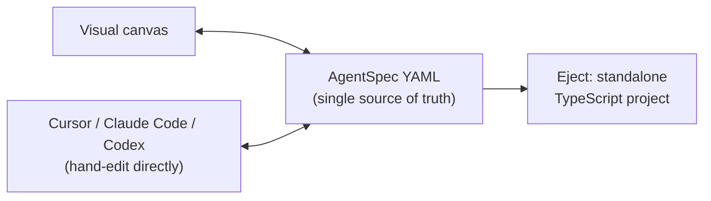

# Kampong Agents

A dev-first agent-workflow builder where the visual canvas and the underlying YAML spec are
the same thing, not two things kept in sync by convention. Design an agent on the canvas, or
hand-write the YAML in Cursor or Claude Code: either way you get one file, always safe to
commit, diff, and review. When you're ready, eject to a standalone TypeScript project with
zero further dependency on this tool.

## Status

Early and pre-alpha. The architecture is decided (see the design docs below) and the repo
scaffolding is wired up (lint, typecheck, build, and all three test layers pass), but no
feature work has shipped yet. There's nothing runnable to install. Track progress in
[`SLICES.md`](./SLICES.md).



## Design docs

- [`PLAN.md`](./PLAN.md): the problem, the scope, the requirements, the shape of the system.
- [`SLICES.md`](./SLICES.md): the build sequence, one demoable slice at a time.
- [`docs/adr/`](./docs/adr/): the architecture decisions and why each one was made.
- [`ideation.md`](./ideation.md): the original research this project grew out of.

## Working on this repo

```sh
npm install
npm run build
npm test
```

That installs every workspace, builds every package, and runs the fast (unit + integration)
test layers. See [`AGENTS.md`](./AGENTS.md) for the full command reference, repo layout, and
the conventions any change here should follow.

Issues and PRs are welcome. Read `AGENTS.md` first, since several of the design decisions
there (YAML as source of truth, TypeScript/Mastra only, no telemetry by default) are
intentional and load-bearing, not oversights.

## License

Apache 2.0. See [`LICENSE`](./LICENSE).
