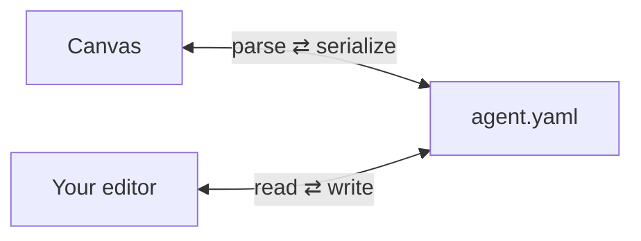

# Concepts

The tutorial shows you how. This page explains the why behind the handful of design choices that
shape everything else. Each links to the architecture decision record (ADR) with the full
reasoning.

## Canvas and YAML are one thing

The central idea. The visual canvas and the `AgentSpec` YAML are not two representations kept in
sync. They are the same artifact seen two ways. Every canvas edit rewrites the YAML through the
validator, and every YAML edit re-renders the canvas.

This is why there's no import step and no "export to YAML". The YAML is the project. It's plain
text you commit, diff, and review like code. The round trip is built to be lossless: parse,
render, serialize, and you get the same file back, comments and formatting included.
[ADR-0002](adr/0002-yaml-source-of-truth-oneway-export.md)

## Layout lives in a sidecar, not the spec

Node positions on the canvas would clutter the spec and create noisy diffs if they lived in the
YAML, so they don't. Canvas coordinates go in a separate `.kampong/layout.json` sidecar, keyed by
step and tool ID. A spec with no sidecar still renders, because the canvas auto-lays-out anything
it hasn't seen before. The spec stays clean and hand-authorable.
[ADR-0006](adr/0006-sidecar-layout-file.md)

## Export is one-way

You can eject a spec to a standalone TypeScript project, but the door only opens outward. The
canvas and CLI never read generated code, only the spec round-trips. Hand-edits to an exported
project stay in that project. This keeps the model simple: there is exactly one source of truth,
and it's the spec.
[ADR-0002](adr/0002-yaml-source-of-truth-oneway-export.md),
[ADR-0010](adr/0010-exported-runtime-is-vendored-not-retemplated.md)

## Local-first, and it fails loudly

Everything runs on your machine. The canvas is a local web app the CLI serves, not a desktop app
and not a hosted service, which is what lets the same UI power a hosted mode later.
[ADR-0005](adr/0005-local-web-app-not-desktop.md)

Two rules follow from taking "local-first" seriously:

- **No silent fallbacks.** A missing API key, an unreachable Ollama server, a missing replay
  fixture: each fails with a specific, visible error. The tool never quietly substitutes a paid
  cloud call or a stale value to keep a run alive.
- **No telemetry by default, and no secrets in specs.** Nothing phones home unless you opt in.
  Specs reference `${ENV_VAR}` placeholders only, and real keys live in your environment.

## One agent at a time, for now

v1 builds a single agent. There's no multi-agent org-chart orchestration yet. The spec schema
leaves room for a `sub_agents` field later, but nothing today assumes it. The bet is to prove the
single-agent design, run, and export loop before adding delegation.
[ADR-0001](adr/0001-single-agent-scope-for-v1.md)

## The stack, briefly

TypeScript end to end, on Mastra. The canvas is React + Vite + `@xyflow/react`, the local server
is Fastify with server-sent events for live run and file-change updates, and YAML is parsed with
the comment-preserving `yaml` package, which is what makes the lossless round trip possible. No
database in v1.
[ADR-0003](adr/0003-mastra-typescript-runtime.md),
[ADR-0007](adr/0007-frontend-and-local-server-stack.md)

For the whole set of decisions, see [Design decisions](design-decisions.md).
