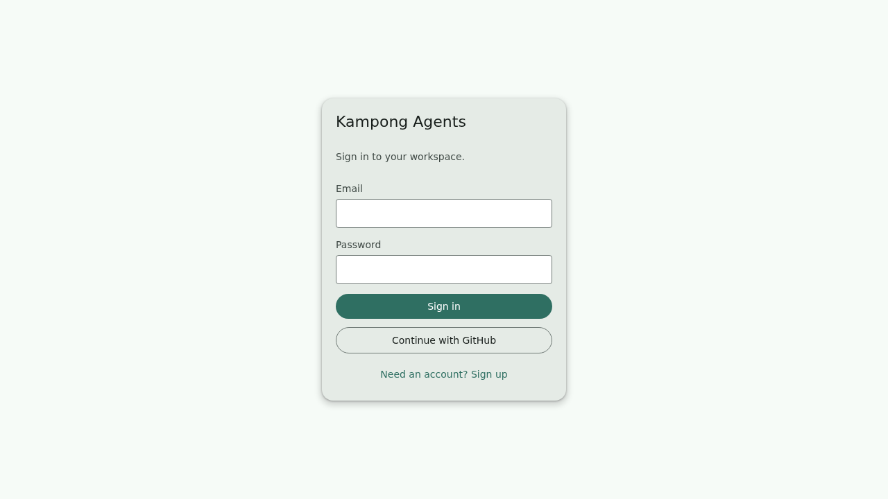
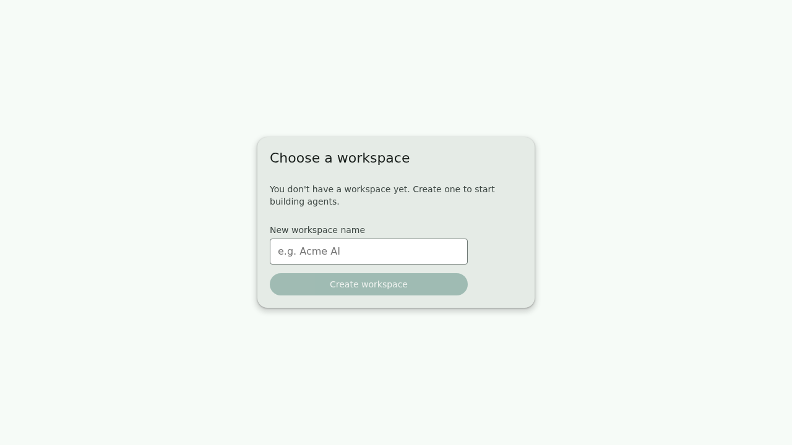
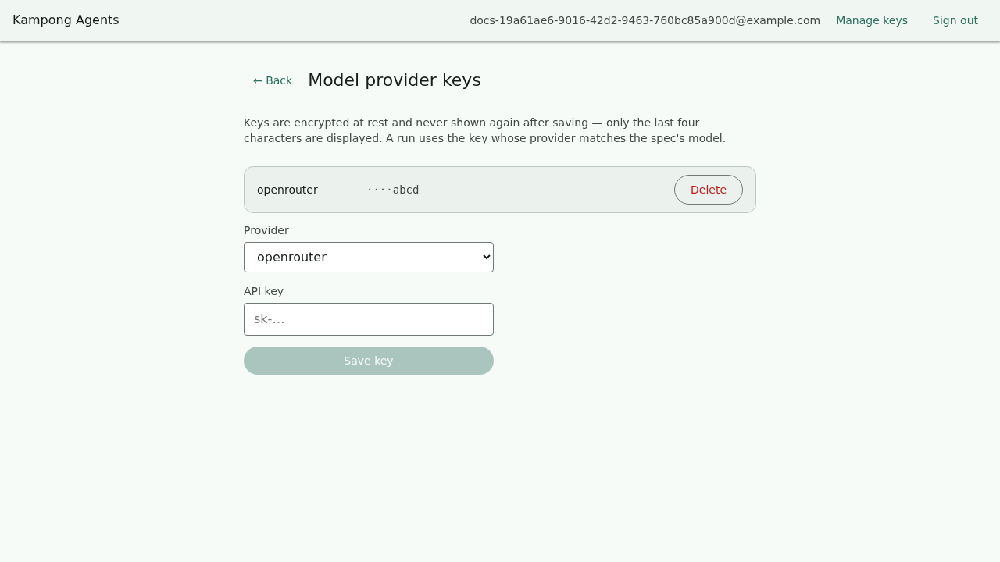
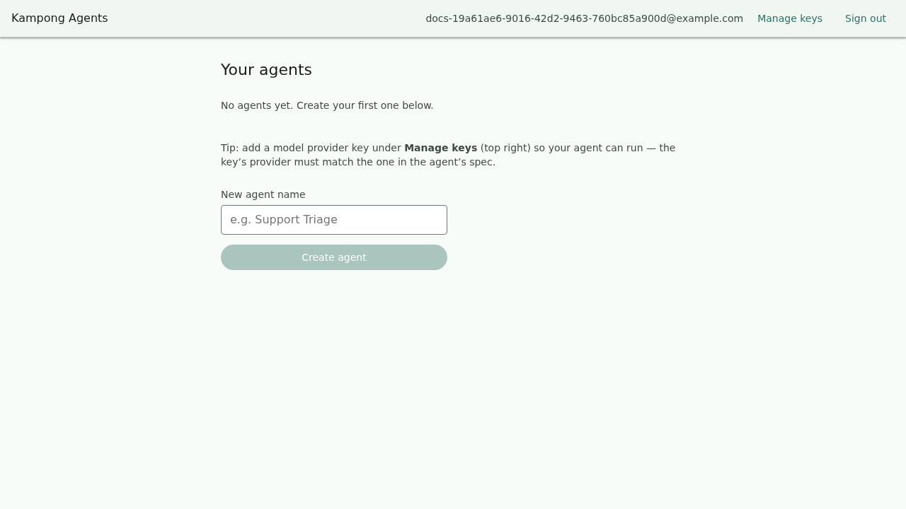
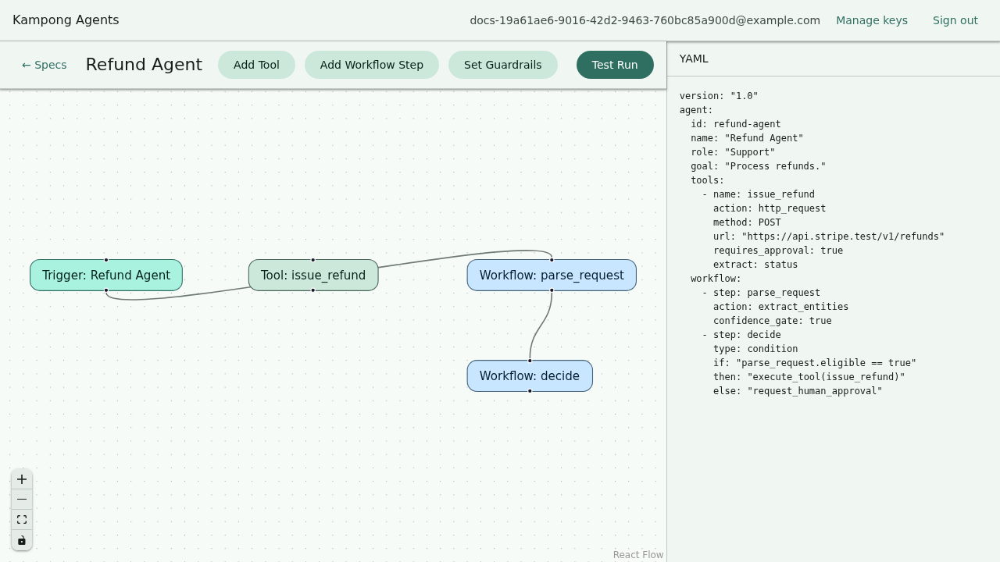
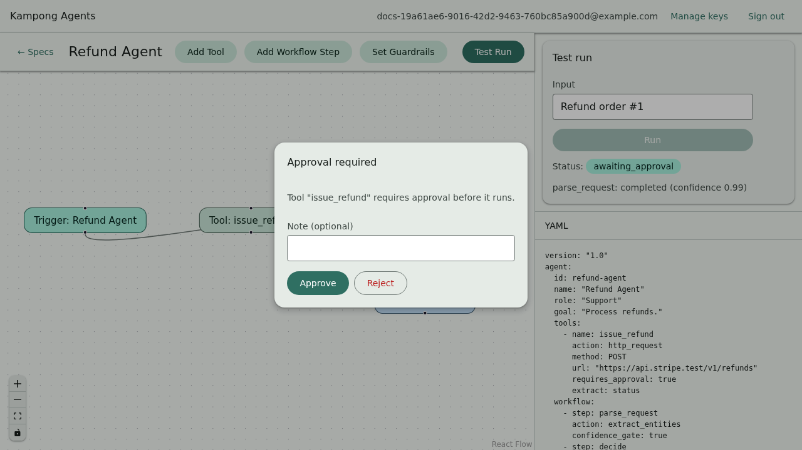
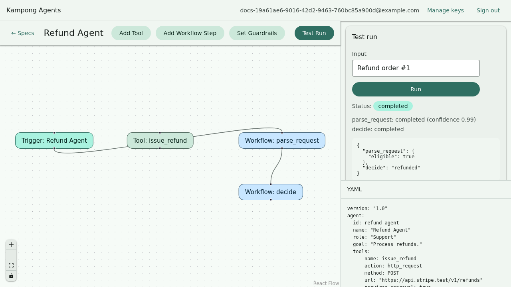

# The hosted app

Everything so far has used `kampong dev` — a local server that edits **one** spec file on your
disk, with no sign-in. The hosted app is the same canvas, served by the multi-tenant server
(`packages/server`), where many people share it and each **workspace** keeps its own specs, its
own model-provider keys, and its own run history in a database.

You use the exact same canvas either way. What the hosted app adds around it is sign-in,
workspaces, and server-side key storage.

!!! info "Same bundle, two servers"
    The canvas figures out which server it is talking to when it loads: if the server answers
    the authentication endpoints, it shows the hosted sign-in flow below; otherwise it behaves
    exactly like local `kampong dev`. You do not choose a mode — you just open the URL your
    server is on.

## Sign in or create an account

The hosted app opens on a sign-in screen. Create an account with an email and password, or use
**Continue with GitHub** if your server has GitHub sign-in configured.

## Create a workspace

A workspace is the tenant boundary: its specs, keys, and runs are visible only to its members.
A brand-new account has none, so you create one.

!!! warning "Switching between existing workspaces"
    Creating a workspace makes it active immediately. Switching to a *different* existing
    workspace is not wired up yet — it needs a server change that is on the roadmap. If you have
    several workspaces, the first one you create is the one you land in.

## Add a model provider key

In local mode a spec's key comes from a `${ENV_VAR}` in your own environment. The hosted server
holds no such environment for you, so each workspace stores its own provider keys. Open
**Manage keys** from the top bar, pick the provider, and paste the key.

The key is encrypted before it is stored and is **never shown again** — the screen only ever
displays the last four characters, enough to recognise which key is there. When a run needs to
call a model, the server decrypts the key for that one call and no more.

!!! important "The provider must match the spec"
    A run looks up the stored key by the `provider` named in the agent's `model` block. If your
    spec says `provider: openrouter`, add an **openrouter** key. A key for a different provider
    will not be found, and the run will stop with a clear "no key configured for provider…"
    message.

## Pick or create an agent

Where local mode edits one implicit spec, a workspace holds many, so the hosted app lands on a
list of the workspace's agents. Open one, or create a new one from a starter template.

Creating an agent drops you straight onto the canvas for it.

## Edit on the canvas

From here the canvas is identical to local mode: the graph on the left, the live YAML on the
right, and **Add Tool** / **Add Workflow Step** / **Set Guardrails** in the toolbar. Everything
in the [tutorial](tutorial/first-agent.md) applies unchanged — the only difference is that your
edits are saved to the workspace's database instead of a file on your disk.

The **← Specs** link in the toolbar takes you back to the agent list.

## Run it, and approve when asked

Press **Test Run**, type an input, and the run streams its steps in the panel. When the agent
reaches a guardrail or a tool that needs sign-off, the run pauses and asks.

Approve it, and the run finishes; the trace and final output stay on screen.

Runs are durable in hosted mode — they are stored per workspace, so you can come back to a past
run's trace later, which the local in-memory runner does not keep.

## Recap

- The hosted app is the same canvas plus sign-in, workspaces, server-side keys, and durable
  runs.
- Each **workspace** isolates its specs, keys, and runs from every other.
- Provider keys are stored per workspace, encrypted, and shown only by their last four
  characters; the key's provider must match the spec's `model.provider`.
- Editing, running, and approving work exactly as they do locally — see the
  [tutorial](tutorial/first-agent.md) for the agent-building details.

Next: **[Your first agent](tutorial/first-agent.md)**, which reads a spec field by field.
