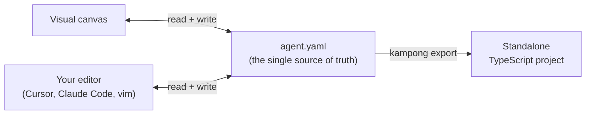

# Kampong Agents

**Build an agent workflow once. Keep it as a file you can read, diff, and review.**

Kampong Agents is a dev-first builder for single-agent workflows. You design an agent on a
visual canvas, or hand-write its YAML in your editor, and either way there's exactly one
artifact: an `AgentSpec` file that both views share. When the agent is ready, you can eject it
to a standalone TypeScript project that no longer depends on this tool at all.

It runs locally. Nothing phones home, secrets stay in your environment, and a run can execute
fully offline against a local model.

## The one idea worth knowing first

The canvas and the YAML are not two things kept in sync. They are the same thing. Every edit on
the canvas rewrites the YAML, and every edit to the YAML re-renders the canvas.



You can start on the canvas and finish in your editor, or the other way around, and the file is
always the truth. It's plain YAML, so it belongs in git next to your code.

## A 60-second taste

Here's a complete agent. It greets the user and answers one question:

```yaml
# yaml-language-server: $schema=./agent-spec.v1.0.schema.json
version: "1.0"
agent:
  id: hello_agent
  name: "Hello Agent"
  role: "Friendly assistant"
  goal: "Greet the user warmly and answer one question in a concise, helpful tone."
  model:
    provider: openrouter
    name: liquid/lfm-2.5-2.6b:free
    api_key: ${OPENROUTER_API_KEY}
  workflow:
    - step: greet
      action: generate_text
      inputs: [input]
```

Run it from the command line:

```sh
kampong run agent.yaml --input "Hi, what can you do?"
```

Or open it on the canvas and press **Run**:

```sh
kampong dev
```

Both execute the same agent, against the same file. That's the whole idea.

## Where to go next

<div class="grid cards" markdown>

- **[Getting started](getting-started.md)** installs the tool and runs your first agent in a
  couple of minutes.
- **[Tutorial: your first agent](tutorial/first-agent.md)** builds up from hello-world, one
  concept per step: models, tools, workflows, guardrails.
- **[Concepts](concepts.md)** covers the design ideas: canvas/YAML duality, local-first
  execution, one-way export.
- **[Reference](reference/cli.md)** documents every CLI command and every field of the
  `AgentSpec` schema.

</div>

## What it does not do yet

Kampong Agents is early. Today it builds one agent at a time, with no multi-agent org charts. It
runs and exports that agent, works offline, and treats hand-editing as a first-class workflow.
Hosted BYOK mode, enterprise governance, multi-agent orchestration, and natural-language spec
generation are on the roadmap, not in the box. See [Design decisions](design-decisions.md) for
the reasoning behind the current scope.
