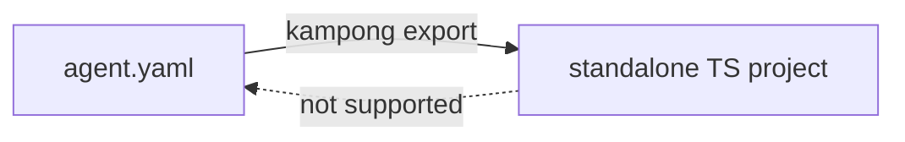

# Ejecting to TypeScript

When an agent is ready, you can eject it to a standalone TypeScript project that has **zero
dependency on Kampong Agents**. It's built on [Mastra](https://mastra.ai) and its own declared
packages, nothing else. Export is how you graduate from the builder to owning the code.

```sh
kampong export agent.yaml ./my-agent
```

The command validates the spec, generates the project, and tells you how to run it:

```
Exported "hello_agent" to /path/to/my-agent (N files).
  cd ./my-agent && npm install && npm start
```

## Run the exported project

It's an ordinary Node project. In a clean directory, with no reference to this tool:

```sh
cd my-agent
npm install
npm start
```

It produces output behaviorally identical to running the same spec on the canvas or through
`kampong run`. The generated `README.md` explains the project's own options.

## Export is one-way

This is the rule to internalize: export goes spec to code, and never back.



The canvas and CLI only ever read and write the YAML spec. They never read your generated
TypeScript. If you hand-edit the exported project, those edits live in the project. They don't
sync back to the spec, and re-exporting won't pick them up.

!!! warning "Re-exporting refuses to clobber by default"
    `kampong export` refuses to write into a directory that already exists and isn't empty, so a
    re-export can't silently overwrite edits you've made. Pass `--force` to overwrite on purpose.

## When to export

Export when you want to leave the builder behind: to drop the agent into a larger codebase, run it
in your own infrastructure, or customize it beyond what the spec expresses. Keep iterating on the
spec while it's still changing shape, and export once it's settled.

That's the full loop: design, run, guard, offline-test, and ship. For editing the spec outside the
app entirely, see [Editing specs in your IDE](external-editing.md). For the exact flags and fields,
see the [Reference](../reference/cli.md).
