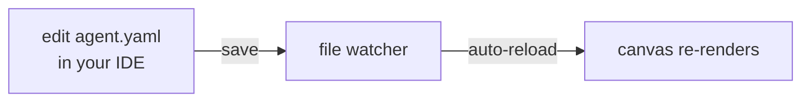

# Editing specs in your IDE

Hand-editing a spec in your own editor (Cursor, Claude Code, Codex, plain vim) is a first-class
workflow, not a fallback. A folder of specs written entirely outside this app renders on the
canvas with no import step, and external edits show up live.

## Point at any folder of specs

`kampong dev` reads a directory. Any valid `AgentSpec` file there renders immediately:

```sh
kampong dev ./my-specs --spec support-bot.yaml
```

There's no "import" or "open project" step. The file on disk is the source of truth, and the
canvas is a view of it.

## Get validation and autocomplete for free

Start a spec file with the schema pragma:

```yaml
# yaml-language-server: $schema=../packages/spec/schemas/agent-spec.v1.0.schema.json
version: "1.0"
agent:
  # ...
```

Any editor with the [YAML Language Server](https://github.com/redhat-developer/yaml-language-server)
(built into VS Code's YAML extension, and what Cursor and others use) reads that line and gives
you inline validation, autocomplete, and hover docs from the published `AgentSpec` JSON Schema. No
custom plugin, no tool-specific editor setup, because the schema is a plain published artifact.

!!! note "One schema gap to know about"
    The JSON Schema marks `model.api_key` as optional for every provider. The real rule (required
    for cloud providers, omitted only for Ollama) is enforced by `kampong` itself when it loads
    the spec, so a cloud spec missing its key still fails, just at run time rather than as a red
    squiggle. Everything else validates in the editor.

## External edits auto-reload

Keep the canvas open and edit the file in your editor. The canvas reloads automatically, with no
prompt and no "the file changed, reload?" dialog. Blocks, connections, and properties re-render,
and your comments and formatting survive the round trip.



The one time the canvas does ask is a genuine conflict: an external write landing while you have
an unsaved change in flight on the canvas. Then it prompts, because silently picking a winner
would lose work. Every other external change reloads quietly.

## Why this works: the spec round-trips losslessly

The canvas parses the YAML, renders it, and on any change serializes it back. That round trip is
designed to be a fixed point: the same file comes back out, comments and layout intact. Node
positions live in a separate sidecar file (`.kampong/layout.json`), never in the spec, so the spec
stays clean and hand-authorable. See [Concepts](../concepts.md) for the reasoning.

The upshot: you can move between the canvas and your editor freely, and commit the result to git
like any other source file.

## Recap

- `kampong dev <dir>` renders any valid spec in a folder with no import step; the file on disk is
  the source of truth.
- The `yaml-language-server` schema pragma gives validation, autocomplete, and hover docs in any
  YAML-aware editor, with no custom plugin.
- External edits auto-reload the canvas silently; it prompts only on a genuine conflict with an
  unsaved in-flight change.
- The spec round-trips losslessly (comments and formatting survive); node positions live in a
  separate `.kampong/layout.json` sidecar.

Next: take the finished agent out of the tool entirely, with
[Ejecting to TypeScript](exporting.md).
