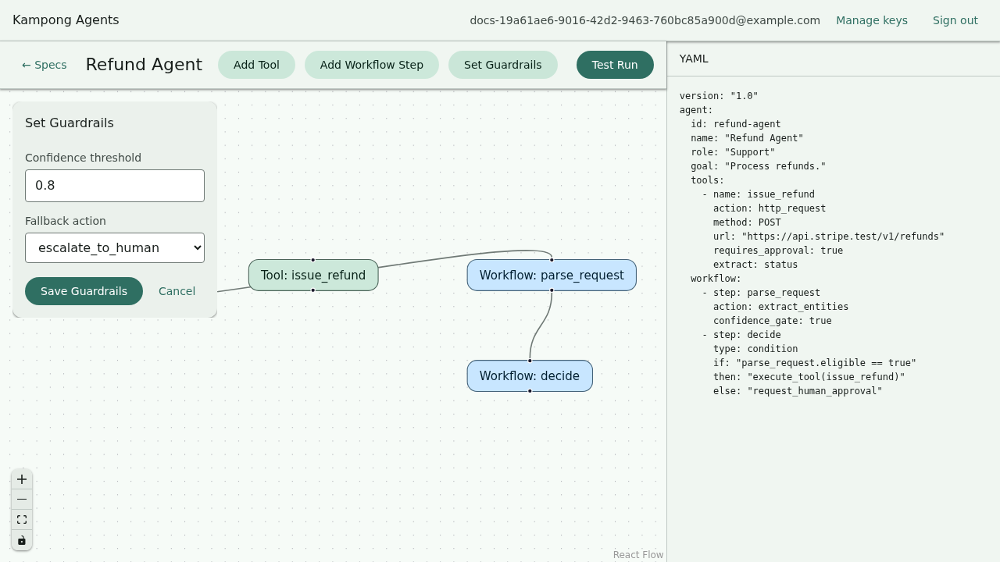
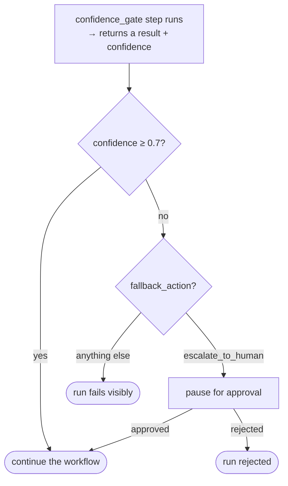

# Guardrails and approvals

Sometimes an agent should stop and ask a person before it acts, or when it isn't sure. Kampong
Agents has two ways to pause a run for a human, and one way to trigger that pause automatically on
low confidence.

## Three ways a run pauses

| Trigger              | Where you set it                               | When it fires                                          |
| -------------------- | ---------------------------------------------- | ------------------------------------------------------ |
| Tool approval        | `requires_approval: true` on a tool            | Right before that tool's HTTP call.                    |
| Explicit approval    | `request_human_approval` as a condition branch | When the branch is taken.                              |
| Confidence guardrail | `guardrails` plus a `confidence_gate` step     | When the step's confidence falls below your threshold. |

The first two are direct: you place them where you want a checkpoint. The third is automatic.

## The confidence guardrail

Add a `guardrails` block to the agent, and mark the step whose confidence should be checked with
`confidence_gate: true`.

```yaml
agent:
  # ...role, goal, model, tools...
  guardrails:
    confidence_threshold: 0.7
    fallback_action: escalate_to_human
  workflow:
    - step: decide
      action: decide
      query: "Decide whether to auto-approve this refund. Return { decision }."
      confidence_gate: true
```

On the canvas, **Set Guardrails** opens a form for the same two fields:



Here's what happens after the `decide` step runs:



| Field                  | Values               | Meaning                                                                            |
| ---------------------- | -------------------- | ---------------------------------------------------------------------------------- |
| `confidence_threshold` | a number from 0 to 1 | Below this, the guardrail fires.                                                   |
| `fallback_action`      | `escalate_to_human`  | What to do when it fires. Today the one supported action is to pause for approval. |

A `confidence_gate` step asks the model for a structured `{ result, confidence }` response. Only
those steps carry a confidence score, so only they can trip the guardrail.

!!! warning "Fail visibly, don't guess"
    If the guardrail fires but `fallback_action` isn't `escalate_to_human`, the run fails with a
    clear message instead of quietly continuing. The whole point of a guardrail is to not paper
    over the case it exists to catch.

## Approving a paused run

However the pause was triggered, the approval experience is the same.

**On the canvas.** A modal appears naming the step and the reason. Approve to continue, or reject
to stop the run.


**From `kampong run`.** The run prompts on stdin:

```
Approval required at step "decide" (guardrail): Confidence 0.4 ... is below the guardrail threshold 0.7.
Approve? [y/N] (reject with a reason via "n:<reason>"):
```

- Type `y` or `yes` to approve.
- Type anything else to reject. Add a reason with `n:<reason>`, like `n:looks risky`, and it's
  recorded in the run result.

A rejected run ends with a `rejected` status and exits non-zero: a clear stop, not a silent one.

## Running unattended

For CI or a scripted run, you can't sit at a prompt. `--approve-all` auto-approves every pause:

```sh
kampong run agent.yaml --input "..." --approve-all
```

Each auto-approval is logged to stderr so you can see what was waved through. Use it when you
trust the input and want the run to complete without stopping.

## Recap

- A run pauses three ways: a tool's `requires_approval`, a `request_human_approval` branch, or a
  confidence guardrail.
- The confidence guardrail needs a `guardrails` block plus a `confidence_gate` step; it fires
  when confidence falls below `confidence_threshold`.
- The one `fallback_action` today is `escalate_to_human` (pause for approval); anything else
  fails visibly.
- Approve on the canvas modal, at the `kampong run` stdin prompt, or with `--approve-all` for
  unattended runs.

Next: run all of this with no network at all, in [Running offline](offline.md).
