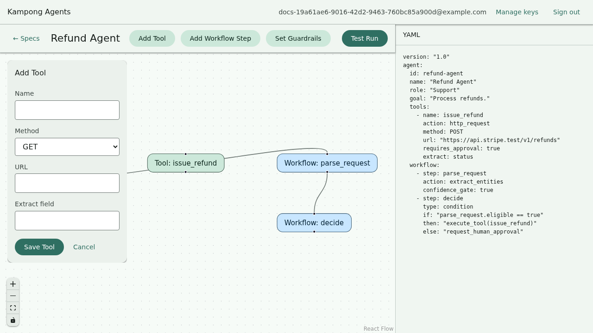

# Adding tools

A tool lets your agent call an HTTP API. You define it structurally (method, URL, what to pull
out of the response) with no code and no LLM call needed to set it up. On the canvas this is the
**Add Tool** form. In the YAML it's an entry under `agent.tools`.

```yaml
agent:
  # ...role, goal, model...
  tools:
    - name: lookup_order
      action: http_request
      method: GET
      url: "https://api.shop.example/orders?ref={input}"
      extract: "order.status"
```

On the canvas, **Add Tool** opens a structured form for exactly these fields — no code, no LLM
call to set it up:



!!! important "Defining a tool doesn't call it"
    Listing a tool under `agent.tools` makes it available. Your agent actually invokes it from a
    **condition step** in the workflow, using `execute_tool(lookup_order)`. That mechanism is on
    the next page, [Workflows and conditions](workflows.md). This page is about defining the tool
    itself.

## The fields

| Field               | Required | What it does                                                                                          |
| ------------------- | -------- | ----------------------------------------------------------------------------------------------------- |
| `name`              | yes      | Identifier you reference from the workflow, e.g. `execute_tool(lookup_order)`.                        |
| `action`            | yes      | Always `http_request` in v1, the one tool kind today.                                                 |
| `method`            | yes      | `GET`, `POST`, `PUT`, `PATCH`, or `DELETE`.                                                           |
| `url`               | yes      | The endpoint. Use `{placeholders}` for values filled in at call time.                                 |
| `extract`           | no       | A dotted path into the JSON response, so the agent gets one field instead of the whole body.          |
| `requires_approval` | no       | If `true`, the run pauses for a human before the call. See [Guardrails and approvals](guardrails.md). |

## Placeholders resolve from the run, not thin air

Curly-brace placeholders in the `url` are substituted when the tool runs. Two kinds of value are
available:

- **`{input}`** is the run's original input text.
- **`{<step>.<field>}`** is a scalar field from a prior step's output, namespaced by the step's
  name. If a step named `classify` produced `{ "city": "Ipoh" }`, then `{classify.city}` resolves
  to `Ipoh`.

```yaml
url: "https://api.weather.example/current?city={classify.city}"
```

A placeholder with no matching value is left in the URL as-is. That surfaces as an honest HTTP
failure rather than a silent wrong value, in keeping with the tool's fail-visibly stance.

## Extracting one field

APIs return more than you want. `extract` is a dotted path into the JSON response body:

```yaml
extract: "order.status"
```

Given `{"order": {"status": "shipped", "id": 42}}`, the agent receives `shipped`. Omit `extract`
and the agent gets the full response to reason over.

## Requiring approval before a call

Some calls shouldn't happen unsupervised: anything that spends money, sends a message, or mutates
data. Mark the tool:

```yaml
- name: send_refund
  action: http_request
  method: POST
  url: "https://api.pay.example/refund?order={input}"
  requires_approval: true
```

When the workflow invokes this tool, the run pauses right before the call. On the canvas you get
an approval modal, and from `kampong run` you get a prompt on stdin. Approve and it proceeds,
reject and the run stops with a clear status. Full mechanics in
[Guardrails and approvals](guardrails.md).

## Testing a tool without the network

Real API calls are slow and non-deterministic. The mock/record layer records a call once and
replays it forever after: same result every time, zero network. See [Running offline](offline.md).

Next: wire the tool into a decision with [Workflows and conditions](workflows.md).
