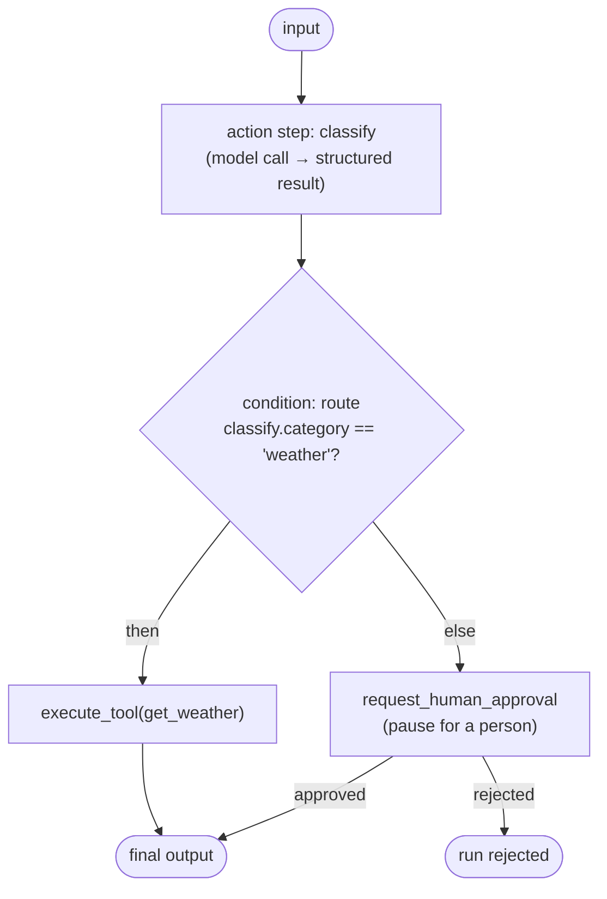

# Workflows and conditions

The `agent.workflow` list is what the agent does, step by step, in order. A spec needs at least
one step. There are two kinds.

## Action steps

An action step runs the model. The starter agent has exactly one:

```yaml
workflow:
  - step: greet
    action: generate_text
    inputs: [input]
```

| Field             | Required | What it does                                                                                                                                                                                                |
| ----------------- | -------- | ----------------------------------------------------------------------------------------------------------------------------------------------------------------------------------------------------------- |
| `step`            | yes      | A unique name for the step. Later steps and conditions refer to it by this name.                                                                                                                            |
| `action`          | yes      | A label for what the step does. Today every action step is a model generation, and the label is passed to the model as context, so use a descriptive verb like `generate_text`, `classify`, or `summarize`. |
| `inputs`          | no       | Field names to flag as relevant, surfaced to the model as "Relevant fields: …".                                                                                                                             |
| `query`           | no       | An extra instruction for this step, surfaced to the model as "Query: …".                                                                                                                                    |
| `confidence_gate` | no       | If `true`, the step returns a structured result plus a confidence score, which a guardrail can check. See [Guardrails and approvals](guardrails.md).                                                        |

Every action step sees the run input, its own `step`/`action`/`inputs`/`query`, and the outputs
of all prior steps. A plain step's output is `{ text: "..." }`. A `confidence_gate` step's output
is the structured `result` object it returns, which is what makes its fields referenceable in a
condition.

## Condition steps

A condition step branches. It evaluates an `if` expression against earlier output and takes one
of two paths:

```yaml
workflow:
  - step: classify
    action: classify
    query: "Classify the request. Return { category, city }."
    confidence_gate: true

  - step: route
    type: condition
    if: 'classify.category == "weather"'
    then: "execute_tool(get_weather)"
    else: "request_human_approval"
```

| Field  | Required | What it does                                |
| ------ | -------- | ------------------------------------------- |
| `step` | yes      | Unique name for the step.                   |
| `type` | yes      | Must be `condition`.                        |
| `if`   | yes      | The expression to evaluate (grammar below). |
| `then` | yes      | Branch action taken when `if` is true.      |
| `else` | yes      | Branch action taken when `if` is false.     |

### The `if` grammar

The expression is deliberately small:

```
<step_id>.<field> <op> <literal>
```

- **`<step_id>.<field>`** is a field from a step that has already run. Referencing a step that
  hasn't run yet is an error, so ordering matters.
- **`<op>`** is one of `==`, `!=`, `>`, `>=`, `<`, `<=`.
- **`<literal>`** is `true`, `false`, a number, or a quoted string (`"refund"` or `'refund'`).

Examples: `classify.category == "weather"`, `score.confidence >= 0.8`, `review.flagged == true`.

!!! note "It's a check, not a full expression language"
    There are no boolean combinators (`and`/`or`) and no arithmetic. One comparison per condition
    step. Chain multiple condition steps if you need more.

### Branch actions

`then` and `else` each resolve to one of exactly two actions:

- **`execute_tool(<tool_name>)`** invokes a tool you defined under `agent.tools`. This is the way
  a tool gets called. The tool's URL placeholders resolve from the run input and prior step
  outputs (see [Adding tools](tools.md)).
- **`request_human_approval`** pauses the run and waits for a person to approve before continuing.
  See [Guardrails and approvals](guardrails.md).

Anything else fails loudly rather than being treated as an opaque no-op.

## How a run flows



Steps run top to bottom, and each one's output is available to everything after it. A failure at
any step stops the run with the step named and a clear message. No partial success pretends to be
a full one.

## Recap

- `agent.workflow` is an ordered list of at least one step, and each step's output is available
  to every step after it.
- Action steps run the model; a `confidence_gate` step returns a structured `{ result,
  confidence }` you can branch on.
- A condition step branches on one `if` comparison, with `then` and `else` each resolving to
  `execute_tool(...)` or `request_human_approval`.
- Anything a branch cannot resolve fails loudly rather than passing silently.

Next: make the agent ask for help when it isn't sure, with
[Guardrails and approvals](guardrails.md).
