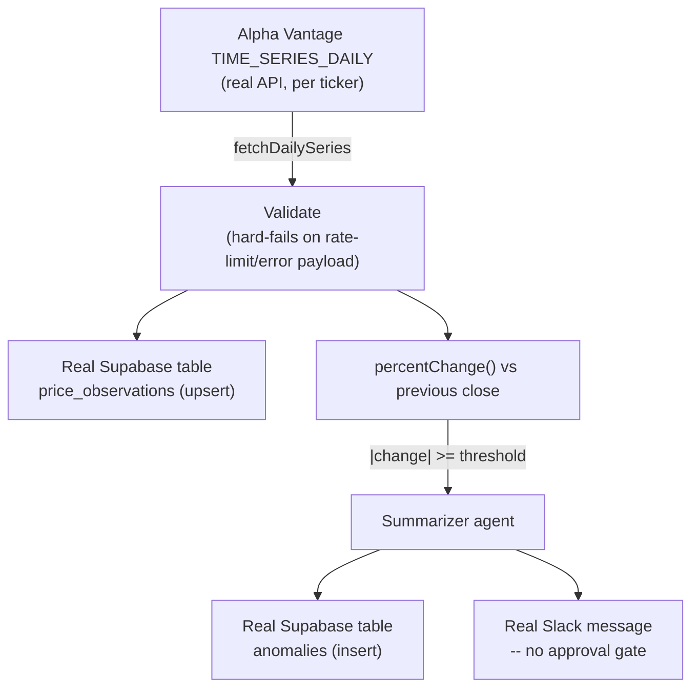

# market-etl

Slice 5 of the `mastra-projects/` discovery initiative (see the root
`PLAN.md`/`SLICES.md`/`docs/adr/`). A real Alpha Vantage → Supabase
market-data ETL job: pull, validate, and load a small fixed set of real
tickers, then autonomously alert a real Slack channel on a real detected
price-move anomaly — deliberately the no-human-in-the-loop end of the
spectrum, the opposite design point from `incident-responder/` and
`support-triage/`'s HITL escalation.

## Architecture

## Dashboard

Open `http://localhost:8791` while `npm run dev` is running: click "Run
now" for an on-demand real run, and watch the ingestion strip (Pull →
Validate → Anomaly?) light up per ticker, plus a running list of every real
anomaly actually flagged — driven by a real `/events` SSE stream
(ADR-0006), sharing `pr-review-swarm/`'s `public/tokens.css` visual
identity verbatim.

## Configuration

Everything below is real — no mocked service, no placeholder that "just works" without it.

| Variable | Required | What it's for |
|---|---|---|
| `OPENROUTER_API_KEY` | Yes | The anomaly-summarizer agent's model calls |
| `ALPHA_VANTAGE_API_KEY` | Yes | Real market data (free, instant, no verification — see Setup) |
| `SUPABASE_URL` | No (defaults to the pre-provisioned project) | Where real price observations and anomalies are stored |
| `SUPABASE_SECRET_KEY` | Yes | Server-side read/write to that project (RLS is on with no policies) |
| `SLACK_BOT_TOKEN` | Yes | Posting the real, autonomous anomaly alert |
| `SLACK_CHANNEL` | Yes | Which real channel alerts go to |
| `TICKERS` | No (defaults to `AAPL,MSFT,NVDA`) | Which real tickers to pull |
| `ANOMALY_THRESHOLD_PERCENT` | No (defaults to 1.5) | Absolute day-over-day percent move that counts as an anomaly |
| `RUN_INTERVAL_MS` | No (defaults to 6 hours) | How often the real scheduled job runs — the dashboard's "Run now" button triggers one on demand regardless |
| `PORT` | No (defaults to 8791) | Where this server and its dashboard listen |

## Setup

1. Get a real, free Alpha Vantage API key instantly (no phone/ID
   verification) at <https://www.alphavantage.co/support/#api-key>.
2. `npm install`
3. `cp .env.example .env` and fill in `OPENROUTER_API_KEY`,
   `ALPHA_VANTAGE_API_KEY`, `SUPABASE_SECRET_KEY` (Supabase dashboard →
   this project's Project Settings → API Keys → **Secret keys**, Supabase's
   current key system — the legacy `service_role` key under "Legacy API
   Keys" also works if that's what the project still shows),
   `SLACK_BOT_TOKEN`, `SLACK_CHANNEL`.
4. `npm run dev`, open `http://localhost:8791`, click "Run now."
5. Check real rows landed in Supabase (`price_observations`), and if the
   default `ANOMALY_THRESHOLD_PERCENT` (1.5%) was crossed by any of the
   default tickers that day, confirm a real Slack message arrived with no
   approval step. To reliably see the anomaly path fire on a quiet trading
   day, temporarily lower `ANOMALY_THRESHOLD_PERCENT` (e.g. to `0.1`) and
   re-run.

## Gap-analysis (kampong-agents `AgentSpec` fit)

Filled in as real runs get executed; a running log, not a final verdict.

- **Confirmed real friction, the headline finding for this slice:** there
  is no scheduled/background-job execution shape in `AgentSpec` or the CLI
  at all. Every existing trigger is either a chat turn, a webhook (GitHub
  PR events, Alertmanager alerts), or (in `support-triage/`'s case) a
  polling loop keyed to external state. "Run this pipeline on a timer with
  no external event to key off of" doesn't map onto any of those — it's a
  fourth, genuinely different trigger shape (`schedule: "0 */6 * * *"` or
  equivalent), not a variant of an existing one. `kampong dev`/`run` are
  both interactive-first (a local server you point a canvas or a manual
  invocation at); nothing in `packages/cli` starts a long-running
  unattended loop today.
- **Confirmed real friction:** this is also the first demo where *nothing*
  ever executes an approval gate — `AgentSpec`'s `requires_approval` and
  guardrail/HITL model (KAN-1432) is opt-in per step, so an `AgentSpec`
  author could already express "no approval needed" simply by omitting it.
  That part is fine. What's missing is upstream of guardrails entirely: a
  workflow with no request/response and no human step still needs
  something to invoke it on a schedule, and today literally nothing does.
- **Confirmed real friction:** Alpha Vantage signals rate-limiting and bad
  requests via a `200 OK` response body field (`Note`/`Information`/`Error
  Message`), not an HTTP status code — a naive `response.ok` check would
  silently treat a rate-limited call as "no data" instead of a hard
  failure. `packages/spec`'s `http_request` tool action (and the exporter's
  generated fetch wrapper) checks only HTTP status today
  (`packages/engine/src/http-tool.ts`); a real `AgentSpec` HTTP tool used
  against Alpha Vantage-shaped APIs would need a configurable
  "how do I detect failure in a 200 response" rule, not just status-code
  checking.
- **Confirmed real friction, observed from a real run:** pulling 3 tickers
  sequentially with no inter-request delay genuinely tripped Alpha
  Vantage's real per-second burst limit — a real run's MSFT call came back
  a 200 OK with an `Information` field reading "...1 request per
  second...", correctly hard-failed by the check above (not silently
  dropped). A separate run's AAPL/MSFT calls instead failed with a generic
  local `fetch failed` that didn't reproduce on retry — network-level
  flakiness, not a finding. The real finding is that `runEtl`'s per-symbol
  loop (`pipeline.ts`) has no pacing between calls at all; anyone running
  this against more than a couple of tickers on Alpha Vantage's free tier
  will hit this for real, not just the already-documented daily cap.
  Detecting a rate-limit failure (the finding above) and avoiding one
  aren't the same problem — a real `AgentSpec` `http_request` tool used
  against a rate-limited real API would need per-tool-call pacing/backoff
  as a first-class config option too.
- **Confirmed working end-to-end, the real pull/validate/store leg:** a
  real run against real market data landed real rows in Supabase
  (`price_observations`: AAPL, NVDA — MSFT correctly excluded after the
  rate-limit hard-fail above, no partial/bad row written) and correctly
  found no anomaly (NVDA −1.47%, AAPL −0.80%, both under the 1.5% default
  threshold), verified directly against the table, not just the SSE
  stream. The anomaly → summarizer → Slack leg remains genuinely untested,
  pending both a real anomaly and real `SLACK_BOT_TOKEN`/`SLACK_CHANNEL`
  credentials.
- **Open, the real question this slice exists to answer:** is a scheduled,
  no-HITL background job in scope for `AgentSpec` at all, or is v1's
  request/webhook/poll-triggered model a deliberate boundary (parallel to
  the existing "v1 is single-agent only" boundary from the main product's
  ADR-0001)? This is a roadmap-shape question, not an implementation
  detail — see `FINDINGS.md`.
- **TODO once a real anomaly has actually fired from real market
  volatility (not a manually-lowered threshold):** does the summarizer
  agent's "numbers, not hype" instruction hold up, or does it need
  tightening once it's summarizing an actually dramatic real move.
