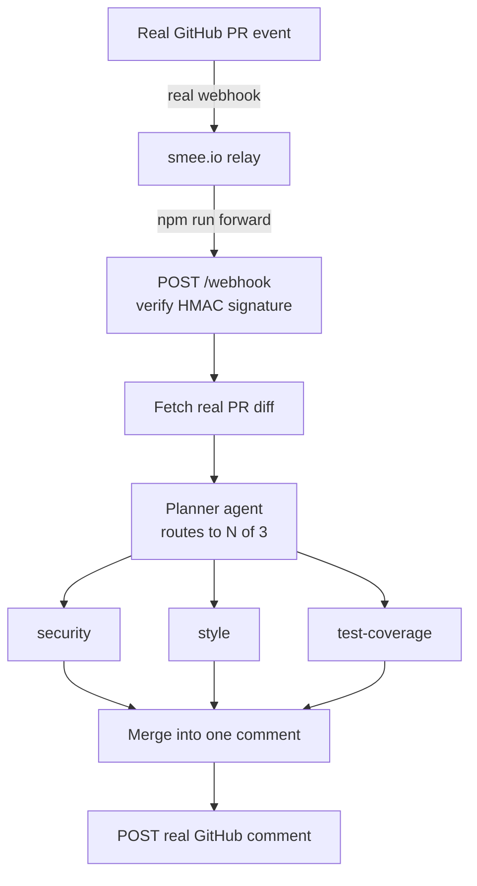

# pr-review-swarm

Slice 1 of the `mastra-projects/` discovery initiative (see the root
`PLAN.md`/`SLICES.md`/`docs/adr/`). A real, multi-agent GitHub PR review
pipeline built directly on Mastra: a planner agent reads a real PR diff and
delegates to whichever of three specialist agents (security, style,
test-coverage) are actually relevant, then posts one merged, real review
comment via the GitHub API.

Target repo: the real, dedicated sandbox
[`leejianrong/kampong-pr-review-sandbox`](https://github.com/leejianrong/kampong-pr-review-sandbox)
(ADR-0003) — not this repo, so review noise never lands on a real product PR.

## Architecture

## Dashboard

Open `http://localhost:8787` while `npm run dev` is running: a live "swarm
map" (planner -> specialists -> merge) lights up as a real PR moves through
the pipeline, next to a live event feed -- both driven by a real `/events`
SSE stream, no polling, no mocked data (ADR-0006). Material Design 3 tokens
generated from a real seed color live in `public/tokens.css`, meant to be
copied as-is into the other 4 `mastra-projects` demos for a consistent
visual identity.

## Configuration

Everything below is real — no mocked service, no placeholder that "just works" without it.

| Variable | Required | What it's for |
|---|---|---|
| `OPENROUTER_API_KEY` | Yes | Every agent's model calls (planner + 3 specialists) |
| `GITHUB_TOKEN` | Yes | Reading the real PR diff and posting the real review comment |
| `GITHUB_WEBHOOK_SECRET` | Yes | Verifying the real webhook's HMAC signature |
| `SANDBOX_REPO` | No (defaults to the pre-created sandbox) | Which repo's PRs trigger a review |
| `SMEE_URL` | No (defaults to the pre-wired channel) | Local relay for GitHub's webhook delivery |
| `PORT` | No (defaults to 8787) | Where this server and its dashboard listen |

## Setup

1. `npm install`
2. `cp .env.example .env` and fill in:
   - `OPENROUTER_API_KEY` — real BYOK OpenRouter key. Every model call in
     every `mastra-projects` demo goes through OpenRouter, never a direct
     Anthropic key.
   - `GITHUB_TOKEN` — a real token with `repo` scope. `gh auth token` works
     if you're logged in via the gh CLI; prefer a fine-grained PAT scoped to
     just the sandbox repo for anything beyond this one-off demo.
   - `GITHUB_WEBHOOK_SECRET` — the secret on the real webhook already
     registered on the sandbox repo (`Settings -> Webhooks`), not a new one
     you generate, unless you replace that webhook.
   - `SMEE_URL` — defaults to the real channel already wired to that
     webhook; only change it if you register a different one.
3. In one terminal: `npm run forward` (relays the real smee.io channel to
   your local `/webhook`).
4. In another terminal: `npm run dev`.
5. Open a real PR against the sandbox repo (or push a commit to an existing
   one) and watch a real review comment appear.

## Gap-analysis (kampong-agents `AgentSpec` fit)

Filled in as real PRs get run through this; a running log, not a final verdict.

- **Confirmed real friction, not hypothetical:** `@mastra/core` and any
  `@ai-sdk/*` provider package are not independently semver-safe against each
  other — a plain `npm install` with caret ranges resolved an
  `@mastra/core@1.67.0` + `@ai-sdk/anthropic@4.0.58` pair that fails to
  typecheck (`LanguageModelV4` shape mismatch). Pinned every `@mastra/core`
  and `@ai-sdk/*`/`ai` dependency to the exact versions kampong-agents' own
  `packages/engine` already uses. Kampong-agents' own exporter should pin
  exact versions in generated projects' `package.json` for the same reason,
  if it doesn't already — worth a `FINDINGS.md` line regardless of what this
  demo concludes about multi-agent support specifically.
- **Also confirmed:** OpenRouter (and Ollama) only implement the classic
  Chat Completions API, not OpenAI's newer Responses API — `@ai-sdk/openai`'s
  bare `createOpenAI(...)(name)` factory call defaults to the Responses API
  and silently targets the wrong endpoint against either provider. Must use
  `.chat(name)` instead; kampong-agents' own `packages/engine/src/model.ts`
  already hit and documented this exact gotcha.
- **Open, the real question this slice exists to answer:** kampong v1 is
  single-agent only (`AGENTS.md`, ADR-0001 in the main product); there is no
  `AgentSpec` field for "one agent delegates to N specialist sub-agents,
  chosen dynamically per input, and their outputs get merged." The reserved
  `sub_agents` field would need at minimum: a routing mechanism (static list
  vs. planner-decided, as here), a fan-out/fan-in execution shape distinct
  from the current linear/conditional workflow, and a way to express "each
  sub-agent gets its own instructions/model" without duplicating the whole
  spec schema per sub-agent.
- **TODO once a handful of real PRs have run through this:** does the
  planner's routing decision hold up against genuinely varied real diffs, or
  does it need few-shot examples/stricter instructions to stop over- or
  under-routing; does merging three independent structured outputs into one
  comment lose anything a human reviewer would want kept separate.
