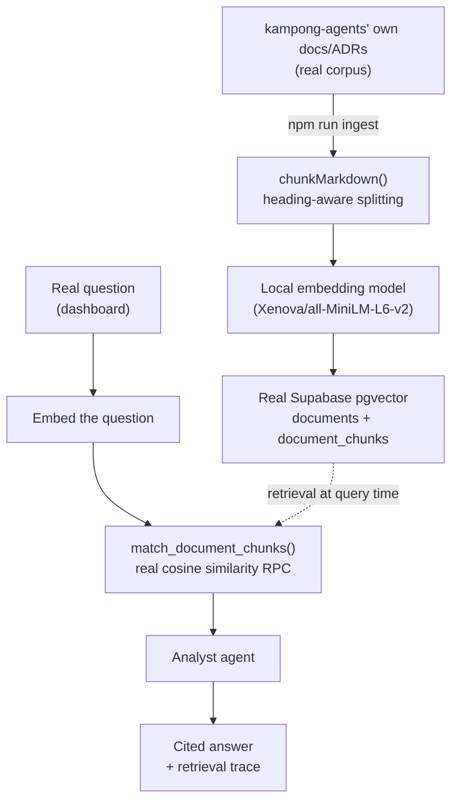

# research-analyst

Slice 4 of the `mastra-projects/` discovery initiative (see the root
`PLAN.md`/`SLICES.md`/`docs/adr/`). A real RAG pipeline over kampong-agents'
own `docs/`/ADRs/planning docs: chunk and embed the real corpus, store real
vectors in a real Supabase pgvector project, retrieve by real cosine
similarity, and answer real questions with citations back to the real
source documents.

## Architecture

## Dashboard

Open `http://localhost:8790` while `npm run dev` is running: ask a real
question, get a real cited answer, and watch a live retrieval trace
(question → embedded → real matched chunks with similarity scores → cited
answer) for every question anyone asks while the dashboard is open — driven
by a real `/events` SSE stream (ADR-0006), sharing `pr-review-swarm/`'s
`public/tokens.css` visual identity verbatim.

## Configuration

Everything below is real — no mocked service, no placeholder that "just works" without it.

| Variable | Required | What it's for |
|---|---|---|
| `OPENROUTER_API_KEY` | Yes | The analyst agent's cited-answer generation |
| `SUPABASE_URL` | No (defaults to the pre-provisioned project) | The real Supabase project storing document chunks + embeddings |
| `SUPABASE_SECRET_KEY` | Yes | Server-side read/write to that project (RLS is on with no policies — only this key can access the tables at all) |
| `OPENROUTER_MODEL` | No (defaults to `openai/gpt-4o-mini`) | Which OpenRouter model answers questions |
| `PORT` | No (defaults to 8790) | Where this server and its dashboard listen |

No embeddings API key is needed — see the gap-analysis below for why.

## Setup

1. `npm install`
2. `cp .env.example .env` and fill in `OPENROUTER_API_KEY` and
   `SUPABASE_SECRET_KEY` (Supabase dashboard → this project's Project
   Settings → API Keys → **Secret keys**, Supabase's current key system —
   the legacy `service_role` key under "Legacy API Keys" also works if
   that's what the project still shows).
3. `npm run ingest` — walks kampong-agents' own root planning docs and
   `docs/**/*.md`, chunks them, computes real local embeddings (downloads
   the `Xenova/all-MiniLM-L6-v2` model weights once, then runs fully
   offline), and upserts real rows into Supabase. Re-running it is
   idempotent (`upsert` on `path` / `(document_id, chunk_index)`).
4. `npm run dev`, then open `http://localhost:8790`.
5. Ask a real question that needs one document (e.g. "what does ADR-0007
   decide about YAML parsing?") and a real question that needs synthesizing
   more than one (e.g. "how do the local-first no-telemetry principle and
   the V5 hosted mode roadmap fit together?"). Watch the retrieval trace and
   check the cited paths actually match what you'd expect.

## Gap-analysis (kampong-agents `AgentSpec` fit)

Filled in as real questions get run through this; a running log, not a
final verdict.

- **Confirmed real friction, the headline finding for this slice:**
  `AgentSpec` already has a `knowledge_base` field
  (`packages/spec/src/schema.ts`, `type: "pdf" | "url" | "text"` +
  `source`), but it is **completely inert at execution time** — a
  `grep -n "knowledge" packages/engine/src/*.ts` returns zero hits. The
  engine builds every agent's instructions purely from `role` + `goal`
  string interpolation (`packages/engine/src/workflow.ts`); `knowledge_base`
  is never read, never chunked, never embedded, never retrieved, never
  injected into a prompt. `docs/reference/agentspec.md` says as much
  explicitly: "Declared, not yet executed." This demo's entire pipeline —
  chunking, embedding, a real vector store, similarity search, citation —
  is the part of "knowledge references" that doesn't exist yet at all, not
  a refinement of something partially working.
- **Confirmed real friction:** OpenRouter has no embeddings endpoint — it
  only implements chat/completions. Every other demo's ADR-0005 answer
  ("resolve the model through OpenRouter") doesn't cover this at all for a
  RAG use case. This demo sidesteps needing a second paid API key by
  running a real local sentence-transformer (`Xenova/all-MiniLM-L6-v2` via
  Transformers.js, 384-dim, no network call after the first weight
  download) instead — genuinely real embeddings, just not sourced the same
  way as the chat call. A real `AgentSpec` `knowledge_base` executor would
  need to make this choice explicitly: bundle a local embedding model (more
  setup-free, but a real runtime dependency and CPU cost) vs. require a
  second BYOK key from a provider that actually serves embeddings (OpenAI,
  Cohere, Voyage) alongside OpenRouter for chat.
- **Confirmed real friction, observed from actually running real questions
  through this:** `match_document_chunks`'s cosine-similarity retrieval
  doesn't always surface the most obviously relevant chunk, even when it
  was ingested. Asking "what does ADR-0007 decide about YAML parsing?" (an
  ADR chunked into `docs/adr/0007-frontend-and-local-server-stack.md`, 6
  chunks per the ingest log) never retrieved from that document at all —
  the analyst answered correctly, but only indirectly, by finding the same
  decision restated in `QUESTIONS.md`'s Q27 register entry, which it
  flagged honestly as an indirect source rather than citing ADR-0007
  itself. Plain embedding-similarity search on a short, specific question
  can miss the actual source document in favor of a shorter, more
  self-contained restatement elsewhere in the corpus. A real `AgentSpec`
  `knowledge_base` retrieval step would need to reckon with this directly
  — e.g. hybrid keyword+vector search, a larger `match_count`, or query
  rewriting — not assume plain cosine similarity is sufficient once a
  corpus has near-duplicate content across documents.
- **Open, the real question this slice exists to answer:** even with an
  execution engine built for `knowledge_base`, static "here are N
  documents" injection (what the field's current `pdf`/`url`/`text` shape
  implies) and real retrieval-with-citations are different capabilities.
  The former is answered by dumping file contents into context — no
  chunking, no vector store, no relevance ranking, and it breaks down fast
  past a handful of small files. The latter (what this demo builds) needs
  a real ingestion pipeline as a first-class concept: a vector store
  connection, a chunking strategy, and a retrieval step that runs *per
  query*, not once at spec-load time. `AgentSpec` would need to
  distinguish these two modes explicitly, not treat `knowledge_base` as
  one field that scales from "attach a PDF" to "RAG over a whole docs
  site."
- **Also open:** citation quality depends entirely on chunk boundaries —
  `chunkMarkdown`'s heading-aware splitting keeps each chunk on-topic, but
  a heading-less section longer than `MAX_CHUNK_CHARS` gets a naive
  fixed-width split, which can cut a citation-worthy sentence in half. Fine
  for a discovery demo's corpus; a real product would want smarter
  (sentence-boundary-aware) splitting.
- **Resolved, from a real run:** asking a genuinely cross-cutting question
  ("how do the local-first no-telemetry principle and the V5 hosted mode
  roadmap fit together?") worked well — the fixed `match_count` (6)
  retrieved enough real coverage to correctly cite 4 distinct source
  documents (`docs/concepts.md`, ADR-0012, `QUESTIONS.md`, `SLICES.md`) in
  one synthesized, accurate answer. The single-document retrieval-miss
  finding above is the sharper edge case here, not multi-document
  coverage.
