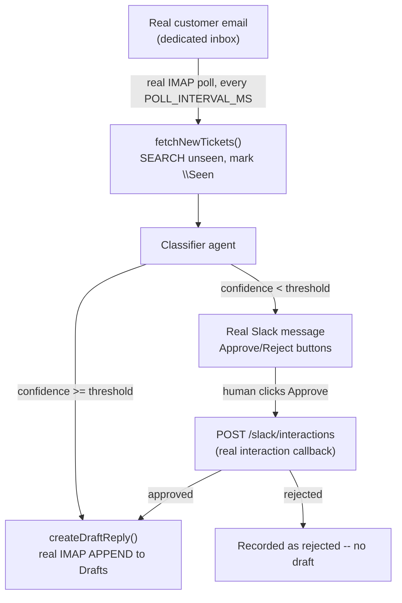

# support-triage

Slice 3 of the `mastra-projects/` discovery initiative (see the root
`PLAN.md`/`SLICES.md`/`docs/adr/`). A real, dedicated Gmail inbox is polled
for support tickets; a Mastra agent classifies each one, drafts a real reply,
and either leaves that reply as a real Gmail draft (confident) or escalates
to a real Slack approval request (not confident) — the same Slack-button HITL
pattern already shipped in kampong-agents' own product (KAN-1432) and reused
in `incident-responder/`.

## Architecture

## Dashboard

Open `http://localhost:8789` while `npm run dev` is running: a live triage
board (Inbox → Classifying → Escalated → Done) whose cards move columns in
real time as a real ticket is polled, classified, and drafted or escalated —
driven by a real `/events` SSE stream (ADR-0006), sharing
`pr-review-swarm/`'s `public/tokens.css` visual identity verbatim.

## Configuration

Everything below is real — no mocked service, no placeholder that "just works" without it.

| Variable | Required | What it's for |
|---|---|---|
| `OPENROUTER_API_KEY` | Yes | The classifier agent's model calls |
| `IMAP_USER` | Yes | The real, dedicated Gmail inbox address this demo polls |
| `IMAP_APP_PASSWORD` | Yes | Real Gmail App Password for that account (Google Account → Security → 2-Step Verification → App passwords) |
| `SLACK_BOT_TOKEN` | Yes | Posting the real escalation message |
| `SLACK_CHANNEL` | Yes | Which real channel escalations are posted to |
| `SLACK_SIGNING_SECRET` | Yes | Verifying the real Approve/Reject button-click callback |
| `SMEE_SLACK_URL` | Yes | Local relay for Slack's interaction callback (Slack requires a public HTTPS Request URL) |
| `IMAP_HOST` / `IMAP_PORT` | No (default `imap.gmail.com` / `993`) | Only needed for a non-Gmail IMAP provider |
| `POLL_INTERVAL_MS` | No (defaults to 30000) | How often the real inbox is polled |
| `CONFIDENCE_THRESHOLD` | No (defaults to 0.7) | Below this, a ticket is escalated instead of auto-drafted |
| `PORT` | No (defaults to 8789) | Where this server and its dashboard listen |

## Setup

1. Create a real, dedicated Gmail inbox (not your personal account —
   ADR-0003). Turn on 2-Step Verification, then generate a real App Password
   for "Mail" (Google Account → Security → 2-Step Verification → App
   passwords), and make sure IMAP is enabled (Gmail Settings → Forwarding
   and POP/IMAP → Enable IMAP).
2. `npm install`
3. `cp .env.example .env` and fill in `OPENROUTER_API_KEY`, `IMAP_USER`,
   `IMAP_APP_PASSWORD`, `SLACK_BOT_TOKEN`, `SLACK_CHANNEL`,
   `SLACK_SIGNING_SECRET`, `SMEE_SLACK_URL` (see the Configuration table).
4. In your Slack app's settings, turn on Interactivity, set its Request
   URL to `SMEE_SLACK_URL`'s value, and make sure **Socket Mode is OFF**.
   With Socket Mode on, Slack delivers clicks over the websocket and never
   makes an HTTP request, so nothing reaches `/slack/interactions` and no
   error is shown anywhere.
5. In one terminal: `npm run forward:slack` (relays Slack's real interaction
   callbacks to your local `/slack/interactions`).
6. In another terminal: `npm run dev`.
7. Open `http://localhost:8789` for the dashboard, then send the dedicated
   inbox a real test email — a clear-cut one (e.g. "how do I reset my
   password?") and a genuinely ambiguous one (e.g. an angry billing dispute
   with no order number). Within `POLL_INTERVAL_MS` the ticket appears on the
   board; watch it move to Done (real Gmail draft) or Escalated (real Slack
   approval request).

## Gap-analysis (kampong-agents `AgentSpec` fit)

Filled in as real tickets get run through this; a running log, not a final
verdict.

- **Confirmed real friction, the headline finding for this slice:**
  kampong-agents' own product Gmail connector (KAN-1430,
  `packages/engine/src/http-tool.ts`'s `gmail_send` case) only sends — it
  builds one RFC822 message from a pre-obtained bearer token
  (`${GMAIL_TOKEN}`) and POSTs it to `messages.send`. There is no
  list/poll/get/draft/label operation anywhere in the product, and no
  `googleapis`/OAuth dependency at all. This demo's entire premise — "poll
  an inbox, classify what's new, leave a draft" — is not expressible with
  today's `AgentSpec` Gmail connector at any level, not even awkwardly. A
  real Gmail-triage `AgentSpec` would need at minimum a new connector action
  (`gmail_list_unseen` or a `trigger: gmail_poll` step kind) and a
  `gmail_create_draft` action, both requiring either real IMAP credentials
  or a full Gmail REST OAuth2 flow — a materially bigger auth story than the
  product's current "hand it a bearer token" pattern, since a bearer token
  alone can only authorize the one call it was minted for, not an ongoing
  poll loop.
- **Confirmed real friction:** Gmail's REST API needs a real OAuth2
  installed-app flow (Cloud Console project, consent screen, Desktop OAuth
  client, refresh token) to get a long-lived credential a headless process
  can use unattended — meaningfully more setup than any other demo's
  credential (a GitHub PAT, a Slack bot token, an Alpha Vantage key are all
  one-step "generate and paste"). This demo instead uses real IMAP + a
  Gmail App Password, which needs only 2-Step Verification + one Google
  Account settings page — a real, deliberate trade-off between fidelity to
  "the Gmail API" and setup cost that a real kampong-agents Gmail connector
  would have to make explicitly, not by accident.
- **Confirmed real friction:** Gmail's Drafts folder path is locale-dependent
  (`[Gmail]/Drafts` only under an English UI); the special-use `\Drafts`
  IMAP flag (queried via `LIST`) is the only reliable way to find it. A
  hardcoded path is a real, silent failure mode for any account not in
  English.
- **Confirmed real friction, Slack approval has no local-only path:**
  Slack's interactivity callback needs a public HTTPS URL, so even a
  laptop demo needs a relay (smee.io here). Worse, smee.io re-sends Slack's
  form-encoded click as JSON, which destroys the exact bytes Slack signed,
  so `verifySlackSignature` can never pass on the relayed body.
  `recoverSlackRawBody()` in `src/server.ts` rebuilds `payload=` + the
  RFC 3986-encoded JSON (spaces as `+`), which reproduces Slack's
  signature exactly and keeps the HMAC check fully on. The same applies to
  `incident-responder/`. A hosted kampong-agents gets a public URL for
  free; local `kampong dev` approval via Slack needs a documented tunnel
  story (or a polling alternative).
- **Confirmed real friction, Socket Mode silently disables HTTP
  interactivity:** the Slack app had Socket Mode on, so Approve clicks
  never produced an HTTP request. No error, no log line. Any kampong
  Slack-HITL setup docs need this called out.
- **Confirmed real friction, classifier needs product knowledge:** with
  only the ticket in the prompt, the model could not reach confidence on
  an ordinary password-reset question and escalated everything. Adding a
  short product FAQ to the system prompt and narrowing the "account
  access = low confidence" rule to identity-verification changes moved
  that ticket to 0.92-0.95 and auto-drafted it (real drafts confirmed in
  the Gmail Drafts folder). This is the same gap as `research-analyst/`:
  `AgentSpec`'s `knowledge_base` is inert (static context at best, no
  retrieval), so a spec-built triage agent would have no way to ground its
  confidence in product docs.
- **The interesting question this slice was picked to answer (SLICES.md):
  how close this gets to what's already shipped.** kampong's existing
  guardrail/HITL model (KAN-1432) is a strong fit for the *escalation* half
  of this demo — `postApprovalRequest`/`verifySlackSignature`/interaction
  parsing needed zero changes, only a rename (`incidentId` → `ticketId`).
  The gap is entirely upstream of HITL: there's no trigger primitive for
  "poll an external inbox on an interval and fan out one pipeline run per
  new message" in the current `AgentSpec` (today's triggers are
  webhook-shaped: GitHub PR events, Alertmanager alerts, a chat turn). A
  polling trigger is a materially different execution shape — no inbound
  request to key a run off of, just a loop discovering new work.
- **Confirmed working end to end, the escalation leg:** a real billing-dispute
  email escalated to Slack; clicking Approve draft returned 200 through
  smee.io, fired `human_decision`, created a real Gmail draft (Drafts folder,
  timestamped seconds after the click) and updated the Slack message.
- **TODO:** does the classifier's confidence self-assessment stay well-calibrated across
  genuinely varied real tickets, or does it need few-shot examples/stricter
  rubric language to stop over- or under-escalating (the diagnostician in
  `incident-responder/` and the planner in `pr-review-swarm/` both needed
  real traffic before their prompts felt right).
